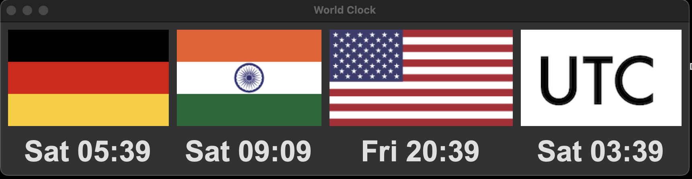

# world-clock
A configurable Python/tkinter GUI to display the time in multiple timezones. 

world-clock uses a config based approach to create all GUI elements. Timezones can be added or removed by updating config.json. Flag images are fetched at startup from flagcdn.com. Time zones are derived from /usr/share/zoneinfo. For more details see the python documentation for time.tzset(). 

Where things get weird - For reasons not yet apparent to me, when using mainloop() and .after() to update the clocks it will either only display the first clock in the config, or not update the clocks at all. In either event a race condition occurs for both. However using a while loop to drive the updates works flawlessly. I suspect this is a combination of how I am lazily creating the labels and the blocking nature of mainloop() waiting for an event to happen. 

The thing about UTC time is it has no country or flag. I created a simple png to cover this use case. If anyone out there is willing to contribute to a better graphic, or knows of a standard representation for UTC please share details.